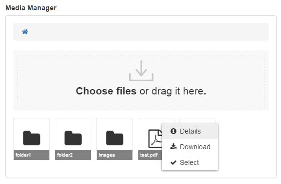

# Media Manager

Media Manager is an open source web file manager and can be a nice alternative to Wordpress Media Manager, CKFinder, KCFinder, elFinder...



This project use Javascript and :
- [VueJS 2](https://github.com/vuejs/vue)
- [Vuex](https://github.com/vuejs/vuex)
- [Axios](https://github.com/mzabriskie/axios)
- [Bootstrap](https://github.com/twbs/bootstrap)
- [Font Awesome](https://github.com/FortAwesome/Font-Awesome)

## Features

- [x] Backends (by using [flysystem](https://github.com/thephpleague/flysystem)) :
  - [x] Local
  - [x] FTP
  - [x] SFTP
  - [x] ... 
- [x] Drag&drop file upload
- [x] Multiple file upload
- [x] Image preview
- [x] Input option
- [ ] Multilanguage
- [ ] File actions :
  - [x] Preview
  - [x] Download
  - [ ] Rename
  - [ ] Move
  - [ ] Delete
- [x] Context menu
- [ ] npm package
- [ ] Integration :
  - [ ] CKEditor plugin
  - [ ] TinyMCE plugin
  - [ ] Drupal module

## Install

...

### Server

Media Manager is a client side tool, it will display files located on a server, it needs a web service :
- you can use a simple server : [mm-server](https://github.com/iutbay/mm-server),
- or you can build your own, take a look at [API doc](doc/API.md).

## Usage

**HTML**
```html
<div id="media-manager"></div>
```
**JavaScript**
```javascript
new MM({
    el: '#media-manager',
    api: {
        baseUrl: 'https://server.com/api/',
        listUrl: 'list',
        downloadUrl: 'download',  // optionnal
        uploadUrl: 'upload',      // optionnal
        deleteUrl: 'delete'       // optionnal
    }
});
```

### With input

**HTML**
```html
<input type="text" id="file-input">
<div id="media-manager"></div>
```

**JavaScript**
```javascript
new MM({
    el: '#media-manager',
    api: {
        baseUrl: 'https://server.com/api/',
        listUrl: 'list'
    },
    input: {
        el: '#file-input',
        multiple: false
    }
});
```

## Options

### `el`

- Type : String
- Details : CSS selector string.

### `basePath`

- Type : String
- Default : ""
- Details : Base path with a trailing slash, e.g. "folder/".

### `api`

- Type : Object
- Details : API Config.

#### `api.baseUrl`

- Type : String
- Default : null

#### `api.listUrl`

- Type : String
- Default : null

#### `api.downloadUrl`

- Type : String
- Default : null

#### `api.uploadUrl`

- Type : String
- Default : null

#### `api.options`

- Type : Object
- Default : {}
- Details : Will be used to create an [axios instance](https://github.com/mzabriskie/axios#creating-an-instance).

### `input`

- Type : Object
- Default : false
- Details : Input config.

#### `input.el`

- Type : String
- Details : CSS selector string.

#### `input.multiple`

- Type : Boolean

### `showBreadcrumb`

- Type : Boolean
- Default : true

### `height`

- Type : String
- Default : null
- Details : Use this if you want a fixed height, e.g. '600px'.

### `onSelect(event)`

- Type : function
- Details : Select callback, use `event.selected` to get selected files.
